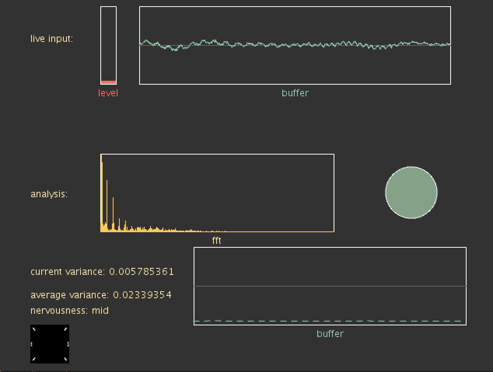

## Sound Variance Analyser

Sound Variance Analyser (SVA) is a software which helps to find the right visual for the current music.

*Analyser Window*

## About
Developed for VJ's and Visual Artist which are tired of work for low payment and work for 8 hours in a club.